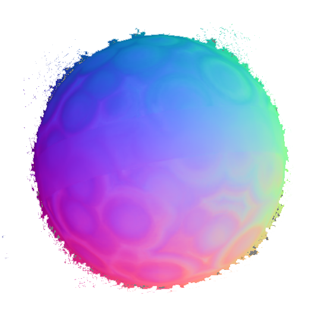

# Specularity in NeRFs: A Comparative Study of Ref-NeRF and NRFF Demo

Check out our paper *Specularity in NeRFs: A Comparative Study of
Ref-NeRF and NRFF* (2025), published in the [MLBriefs 2024](https://mlbriefs.com/) workshop of the *Image Processing On Line* journal ([IPOL](https://www.ipol.im/)).


This demo compares two models for specular reflections: **Ref-NeRF** [1] and **NRFF** [2]. The comparison is performed across multiple views in RGB, normal maps, and three evaluation metrics (PSNR, SSIM, and LPIPS). 

For this evaluation, two objects were selected from the [*Shiny Blender* dataset](https://storage.googleapis.com/gresearch/refraw360/ref.zip), and an additional object was specifically designed, which can be found [here](https://zenodo.org/records/12568381).


<p align="center">
    
    
    
</p>

<p align="center">
    
    
</p>

**Figure 1:** Sample comparisons for `anisotropic object`. The first row shows GT, NRFF, and Ref-NeRF RGB. The second row shows NRFF and Ref-NeRF Normals.


## Running the Demo
To run the demo on your local machine:

1. Clone the repository:
   ```bash
   git clone  https://github.com/AlbertBarreiro/Albert_demo_mlbriefs4.git
   cd Albert_demo_mlbriefs4
   ```

2. Ensure the necessary dependencies are installed:
   ```bash
   pip install -r requirements.txt
   ```

3. Set the bin path:
   ```bash
    bin="$(pwd)"
    ```

4. Run the demo with the desired dataset file and azimuth angle (must be between -160 and 160):
   ```bash
   bash main.sh <dataset> (e.g., dataset_toaster, dataset_ani, dataset_ball) <azimuth_angle>
   ```
   Example:
   ```bash
   bash main.sh dataset_toaster 30
   ```


## Citation
If you find this useful, please cite:
```
@article{barreiro2025specularity,
  title={Specularity in NeRFs: A Comparative Study of Ref-NeRF and NRFF},
  author={Barreiro, Albert and Mar{\'\i}, Roger and Redondo, Rafael and Haro, Gloria and Bosch, Carles and Berga, David},
  journal={Image Processing On Line},
  year={2025}
}
```

## License
This code is released under the **MIT License**. See `LICENSE` for details.

## References
[1] D. Verbin, P. Hedman, B. Mildenhall, T. Zickler, J. T. Barron, and P. P. Srinivasan, “Ref-nerf: Structured view-dependent appearance for neural radiance fields,” CVPR, 2022. [Ref-NeRF Info Page](https://dorverbin.github.io/refnerf/)

[2] K. Han and W. Xiang, “Multiscale tensor decomposition and rendering equation encoding for view synthesis,” CVPR, 2023. [NRFF Info Page](https://imkanghan.github.io/projects/NRFF/main)

